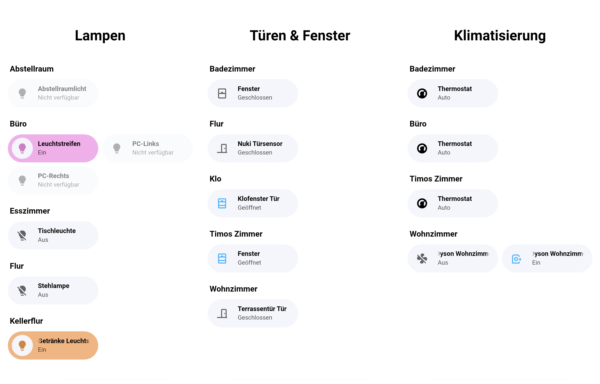

# Auto Area Device Card

[](https://github.com/hacs/integration)

A Home Assistant Lovelace card that lists entities grouped by area, auto-updating as devices and areas are added or removed — no fixed per-room list to maintain.



## Why

The usual pattern for a "devices by category" page in Lovelace is a static list of `auto-entities` cards, one per room, each filtered to `area: <slug>`. Every new room needs a new section, and every new device needs to already be assigned to an area that's referenced somewhere — otherwise it silently doesn't show up. This card replaces that with one card per category: it reads the entity and area registries directly and rebuilds its groups whenever the *set* of matching entities/areas changes, not on every state update.

## Requirements

- [Bubble Card](https://github.com/Clooos/Bubble-Card) — this card renders its buttons as `custom:bubble-card` elements.

## Installation

### HACS (recommended)

[](https://my.home-assistant.io/redirect/hacs_repository/?owner=Todt40&repository=auto-area-device-card&category=plugin)

1. In HACS, go to the three-dot menu (top right) → **Custom repositories**, add this repository's URL with category **Dashboard**.
2. Search for "Auto Area Device Card" in HACS and install it.
3. HACS adds the Lovelace resource automatically. Reload your browser (clear cache if the card doesn't show up) and add the card to a dashboard.

### Manual

1. Copy `auto-area-device-card.js` into `config/www/auto-area-device-card/` on your Home Assistant instance.
2. Add it as a Lovelace resource (Settings → Dashboards → ⋮ → Resources → Add Resource):
   ```
   URL: /local/auto-area-device-card/auto-area-device-card.js?v=1
   Type: JavaScript Module
   ```
   The `?v=1` is a manual cache-buster — bump it (`?v=2`, `?v=3`, ...) whenever you update the file, so browsers that already cached the old version pick up the change.

## Usage

```yaml
type: custom:auto-area-device-card
filters:
  - domain: light
```

This shows every `light.*` entity, one bubble-card toggle button per entity, grouped under a header per area, sorted by area name then entity name.

### Multiple filters

Entities matching *any* filter are included (first matching filter wins if more than one would match the same entity):

```yaml
type: custom:auto-area-device-card
filters:
  - domain: binary_sensor
    device_class: motion
  - domain: binary_sensor
    device_class: occupancy
```

`domain`/`device_class` also have plural forms — `domains`/`device_classes` — for matching any of several at once, so the example above can also be written as one filter:

```yaml
type: custom:auto-area-device-card
filters:
  - domain: binary_sensor
    device_classes: [motion, occupancy]
```

Or match across several domains the same way:

```yaml
type: custom:auto-area-device-card
filters:
  - domains: [sensor, binary_sensor]
```

### Catch-all minus specific device classes

Omit `device_class`/`device_classes` and add `exclude_device_classes` to match a domain except for classes handled elsewhere:

```yaml
type: custom:auto-area-device-card
filters:
  - domain: binary_sensor
    exclude_device_classes: [motion, occupancy, door, window]
```

### Any domain except a list

Omit `domain`/`domains` and use `exclude_domains` for a true catch-all:

```yaml
type: custom:auto-area-device-card
filters:
  - exclude_domains: [light, switch, camera, automation, script, scene, zone, person]
```

### Real sensors vs. computed/helper ones

`exclude_platforms` reads the entity registry's `platform` field to tell a real hardware sensor apart from a computed one — HA's own `template`, `threshold`, `derivative`, `statistics`, etc. integrations all create entities that look like ordinary sensors but aren't backed by actual hardware:

```yaml
type: custom:auto-area-device-card
filters:
  - domains: [sensor, binary_sensor]
    exclude_platforms: [template, threshold, derivative, statistics, utility_meter]
```

### Button type

`button_type` defaults to `switch` for `light`/`switch` domains and `state` (opens more-info on tap) for everything else. Override per filter:

```yaml
type: custom:auto-area-device-card
filters:
  - domain: climate
    button_type: state
```

### Explicit entity list instead of filters

Instead of `filters:`, pass an explicit list of entity IDs — the card still groups them by area and excludes the same things (see below), it just skips its own filter matching entirely:

```yaml
type: custom:auto-area-device-card
entity_ids: [light.kitchen, switch.coffee_maker]
button_type: state   # optional, same default as a filter's button_type —
                      # just one value for the whole list here
```

Use this when you've already worked out exactly which entities belong on the card elsewhere — for example, resolving several categories against the same entity list with "first category wins" logic, which this card's own filter matching (scoped to just its own `filters:`) has no way to do across separate card instances.

### Hiding areas

By default, any area with the label `hidden` is skipped entirely. Customize with `hidden_labels`:

```yaml
type: custom:auto-area-device-card
filters:
  - domain: light
hidden_labels: [hidden, no_dashboard]
```

### Floors

By default, an area with no floor assigned (Settings → Areas → Floors) is dropped entirely — a network closet, or an "Admin"/"Misc" area created just for organizing entities rather than an actual room, shouldn't show up as one. Set `require_floor: false` to show every matching area regardless of floor assignment:

```yaml
type: custom:auto-area-device-card
filters:
  - domain: light
require_floor: false
```

### Empty state text

```yaml
type: custom:auto-area-device-card
filters:
  - domain: humidifier
empty_text: No humidifiers found.
```

## What gets excluded automatically

Regardless of your filters (or `entity_ids:`), the following are never shown:

- `event.*` and `notify.*` domain entities
- Entities belonging to a `group` platform (helper light/switch groups)
- Entities with `browser_mod` or `zigbee2mqtt_bridge` in their entity ID
- Entities with an `entity_category` set (config/diagnostic entities)
- Entities that are hidden or disabled in the entity registry
- Entities not assigned to any area (directly, or via their device)
- Areas with no floor assigned, unless `require_floor: false`

## Performance

Rebuilding the card's DOM (creating new bubble-card elements) only happens when the *set* of matching entity IDs actually changes — a fast-changing sensor elsewhere in your system won't cause this card to tear down and recreate its buttons on every update. Only fresh `hass` state is pushed to the already-existing buttons on every update, which is cheap.

## Issues

Found a bug or have a feature request? [Open an issue](https://github.com/Todt40/auto-area-device-card/issues).

## Support

[](https://buymeacoffee.com/todt40)

## License

MIT
